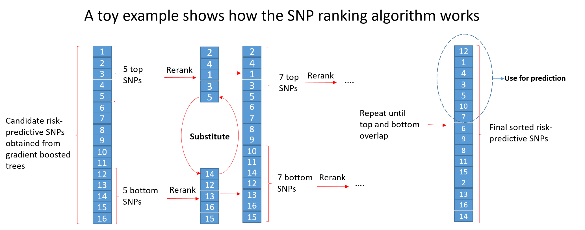

# Updating...
# Breast cancer risk prediction using genotyped data

This repositroy provides the implementation source codes used in the mauscript entitled **[Machine learning identifies interacting genetic variants contributing to breast cancer risk: A case study in Finnish cases and controls](https://www.nature.com/articles/s41598-018-31573-5)** to present results and discussion. Due sensitivity of sample sets, implementation source codes in this repository use a randomly generated data with the same size and elements as the original sample sets. 

## Python requirements
**Libraries**  **version**

Python            2.7.12

xgboost           0.6a2

scipy             0.18.1

numpy             1.11.2

matplotlib        2.1.1

pandas            0.19.2

sklearn           0.18.2

## Steps in running the source codes
1- XGBoost optimization: These python codes could be run in parallel. 

**xgboost_optimization_0.py**:  Gird search over n_estimators = [50, 100], max_depth = [2, 4, 6, 8] and learning_rate = [0.001, 0.01, 0.1].

**xgboost_optimization_1.py**: Gird search over n_estimators = [150, 200], max_depth = [2, 4, 6, 8] and learning_rate = [0.001, 0.01, 0.1].

**xgboost_optimization_2.py**: Gird search over n_estimators = [250, 300], max_depth = [2, 4, 6, 8] and learning_rate = [0.001, 0.01, 0.1].

2- Adaptive iterative SNP selection (Algorithm 1 in the manuscript): 
